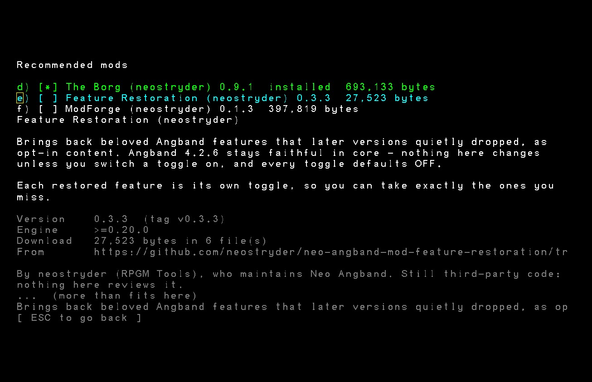

# Feature Restoration

Beloved Angband features that later versions quietly dropped, brought back as opt-in
content for [Neo Angband](https://github.com/neostryder/neo-angband).

**This is a mod.** It is off until you enable it, every restored feature inside it is a
named switch you can turn off on its own, and disabling the mod leaves the game exactly
as Angband 4.2.6 plays it.



## What it is not

This is not a rebalance and not a house-rule collection. Everything here is something
Angband itself used to do, in an earlier version, for a class or a mechanic that later
lost it. If it never existed in any Angband, it does not belong in this mod.

It is also not a fix for the identify-sell-restock town loop feeling gone in 4.2.6.
That loop is not gone: `birth_no_selling` ("Increase gold drops but disable selling")
is a birth option in the base game, on by default, and it is the default that makes
selling feel removed. Turn it off when you start a character and stores buy again,
with no mod installed at all.

## What it adds

Every toggle below defaults **off**. Enabling this mod changes nothing on its own -
you still choose which restorations you actually want.

| Section | Default | What it does |
|---|---|---|
| **Restore Teleport Other** (`teleport-other`) | off | Gives the Priest, the Paladin and the Ranger the same "teleport the monster in front of you away" spell the Mage and the Rogue already have in Angband 4.2.6. Angband 4.1.3, the last official release before the 4.2.0 spellbook rewrite, gave it to every caster; 4.2.6 kept it for two classes and dropped it for the rest. |
| **Restore store discounts** (`discounts`) | off | Stores occasionally sell an item at a random discount, the way Angband 3.0.6, the last official release to carry the mechanic, did. 4.2.6 dropped the mechanic entirely. |
| **Restore door spiking** (`spike-doors`) | off | Adds Iron Spikes as a findable item and a `spike` command that spends one to jam a closed door, making it harder to pick open. Angband 3.4.1, the last official release before the 4.0 command rewrite dropped both, is the source; 4.2.6 has neither. **Not yet reachable in play** - the command is wired and tested, but the game has no key or menu entry that dispatches it yet; see below. |

### Restore Teleport Other

Angband 4.2.6 ships `Teleport Other` - a bolt spell that teleports the first monster it
hits away, farther at higher character level - for the Mage (`[Magical Defences]`,
level 15) and the Rogue (`[Arcane Control]`, level 30). Angband 4.1.3, released 22 July
2018 and the last official release before the 4.2.0 spellbook rewrite, gave it to the
Priest, the Paladin and the Ranger as well. All three lost it at 4.2.0, the release that
cut pure casters from nine spellbooks to five and hybrid casters to two or three.

This section adds it back to those three, appended to a book each already has rather than
replacing anything:

| Class | Book | Level | Mana | Fail | XP |
|---|---|---|---|---|---|
| Priest | `[Healing and Sanctuary]` | 18 | 10 | 30% | 20 |
| Paladin | `[Healing and Sanctuary]` | 24 | 10 | 30% | 50 |
| Ranger | `[Nature Craft]` | 30 | 10 | 30% | 50 |

The spell's effect and its description text are copied byte-for-byte from the Mage's copy,
so it is exactly the same spell in every caster's hands.

#### Where these numbers come from

The historical record sets the shape of the restoration. It does not set the price. A
spell priced by 4.1.3 and dropped into 4.2.6 would charge a Priest 20 mana at 80 percent
failure for a spell the Mage buys at 10 mana and 30 percent, which is a penalty rather
than a restoration. So the 4.1.3 record is the starting point and the two surviving
copies of the spell are the guide.

Angband 4.1.3, the last official release to carry them, gave the three classes these
records, where a spell reads `name:level:mana:fail:exp`:

```
Teleport Other:20:20:80:16    (Priest)
Teleport Other:25:25:80:12    (Paladin)
Teleport Other:31:25:70:3     (Ranger)
```

The rows are unchanged across the whole 4.1.x series (4.1.0 through 4.1.3), so citing
4.1.3 rather than an earlier point release changes nothing about the numbers, only which
tagged release is the last one they can be checked against. Those records also survive
inside the game's own repository as `reference/lib/gamedata/old_class.txt`, which
upstream keeps alongside the current `class.txt` for exactly this kind of comparison, so
every number below can be checked without leaving the checkout. The two classes that kept
the spell moved like this:

```
Mage   23:12:60:8   ->  15:10:30:12     level -8, mana -2, fail -30, exp +4
Rogue  31:25:70:3   ->  30:10:30:50     level -1, mana -15, fail -40, exp +47
```

**Mana 10 and fail 30, all three classes. Measured.** Both surviving copies land on
exactly 10 and 30 from different starting points, so there is nothing left to choose
between. That is not an accident of two rows: Angband 4.2 repriced spells to cost the
same in every class that has them, and the shift is countable across the whole spell
list. Among spells shared by two or more classes, agreement on mana went from 4 of 88 in
4.1.3 to 15 of 29 now, agreement on fail from 23 of 88 to 25 of 29, and agreement on
both from 1 of 88 to 14 of 29. Level is the axis 4.2 deliberately kept class-specific.

**Level follows the model for the class, softened for the full caster.** The Priest is a
full caster and takes the Mage as its model; the Paladin and the Ranger are half casters
and take the Rogue. The Rogue's level fell by 1, so the Paladin goes 25 to 24 and the
Ranger 31 to 30. The Mage's fell by 8, and the Priest takes a much smaller cut, 20 to 18.
The size of that softening is a **judgment call**, not a measurement: the Mage is the
earliest caster in the game and the deepest cut belongs to it. The Paladin's single level
is cosmetic, there for consistency with its model rather than for balance.

**Exp follows the caster class.** The Priest takes the Mage's delta, 16 up to 20, which
keeps it in the full-caster band next to the Mage's 12. Both half casters go to 50,
matching the Rogue's actual value rather than adding its absolute delta, since adding +47
to the Paladin's 12 would give 59 and nothing suggests 4.2 would price one spell
differently for two half casters. The current file shows the Rogue drawing roughly four
times the Mage's exp for the same spell, on Teleport Other and on Teleport Level alike,
so a half-caster band near 50 and a full-caster band near 12 to 20 is the pattern being
matched. Which band each class sits in is measured; the exact 50 for the Paladin is a
**judgment call**.

**The check on the whole set.** The Ranger's result, `30:10:30:50`, is identical to the
Rogue's current row. The two classes also had identical 4.1.3 rows, `31:25:70:3`, so them
matching again after the transition is the expected outcome rather than a coincidence.
The test suite asserts that equality against the published content pack, so a future core
release that reprices the Rogue's copy fails here instead of leaving this mod stale.

The resulting ladder across all five classes reads Mage 15, Priest 18, Paladin 24,
Rogue 30, Ranger 30. Full casters get it early and half casters late, and the three
restored classes keep the same relative order they had in 4.1.3.

The mechanics behind the price were checked as well, since a changed formula would
invalidate the whole exercise. Mana accrual per class did not change: the `magic:` line
that carries a class's first spell level and its spell weight is identical in both files
for all five classes (Mage 1:300, Priest 1:350, Rogue 5:350, Ranger 3:400,
Paladin 1:400), and the failure rate still falls by 3 points per character level above
the spell's own level. So a price expressed in mana and fail means the same thing in both
versions, and only the price itself needed moving.

If a core release reorders a class's books or adds a spell to one of them, the tests below
fail rather than this mod quietly patching the wrong slot.

**Where this idea came from:** a
[r/angband comment thread](https://www.reddit.com/r/angband/comments/1vsb2sp/angband_but_moddable/) on the game's
alpha announcement, where a player pointed out that "nearly everyone" had lost Teleport
Other in 4.2 - a mechanic every earlier version gave every caster.

### Restore store discounts

A version of Angband before 4.2.6 gave `mass_produce` (the routine that decides how
much of an item a store stocks when it restocks) a second job: after sizing the stack,
roll a discount. The code is unchanged from Angband 3.0.0 through **Angband 3.0.6
(18 June 2005), the last official release to carry it.** Three beta snapshots that
followed it - 3.0.7s1, 3.0.7s2 and 3.0.7s3, released by a maintainer-to-be before she
was made maintainer - still carried the same code, but none of the three was an official
release; Angband never shipped an official 3.0.7. Angband 3.0.8 (8 July 2007), the next
official release after 3.0.6, removed the roll as part of what its own changelog calls a
"semi-rewrite of the store code," and no official release since has brought it back.
Fetched directly from the real upstream history
(`gh api repos/angband/angband/contents/src/store.c?ref=v3.0.6`, since 4.2.6's own
`reference/` tree in the game's repository does not carry this code - it was removed by
3.0.8, decades before the tag this port targets), the roll reads:

```c
/* Pick a discount (store.c, mass_produce, Angband 3.0.6) */
if (cost < 5)            discount = 0;
else if (rand_int(25) == 0)  discount = 10;
else if (rand_int(50) == 0)  discount = 25;
else if (rand_int(150) == 0) discount = 50;
else if (rand_int(300) == 0) discount = 75;
else if (rand_int(500) == 0) discount = 90;
```

Each check only runs if the one before it missed, cheapest tier first, and an item under
5 gold never qualifies. That is the entire mechanism this section restores - the same
tiers, the same odds, checked in the same order, nothing added and nothing rebalanced.
`plugin.ts`'s `discountRoll` is a direct transcription; `plugin.test.ts` asserts the exact
`oneIn` calls (25, then 50, then 150, then 300, then 500) in that order, not just the
resulting percentages.

4.2.6 dropped both the roll and the field it wrote to (`obj->discount`) - there is nothing
left in core to patch data onto, which is why this one restoration needs `plugin.ts`
instead of a `class.json`-style content patch. See the section below.

### Restore door spiking

Angband let a player jam a closed door shut with an iron spike, making it harder to open
- useful for buying time against something chasing you, or for sealing a room you have
already cleared. The item (`TV_SPIKE`) and the command (`do_cmd_spike`) are unchanged
from Angband 3.0.0 through **Angband 3.4.1 (18 October 2012), the last official release
to carry either.** Angband 4.0.0, the next official release, rewrote command dispatch
from switch-driven functions to a registered-command table and dropped both the item
kind and the command in the process; no official release since has brought either back.
Neither exists anywhere in 4.2.6 - not the item kind, not the command, and the
`DOOR_JAMMED` terrain flag this port still carries as a generated constant is dead
vocabulary too: nothing anywhere sets it. Fetched directly from the real upstream history
(`gh api repos/angband/angband/contents/src/cmd2.c?ref=v3.4.1` for the command,
`.../lib/edit/object.txt?ref=v3.4.1` for the item), the mechanism reads:

```c
/* Jam a closed door with a spike (cmd2.c, do_cmd_spike, Angband 3.4.1) */
/* Convert "locked" to "stuck" */
if (cave->feat[y][x] < FEAT_DOOR_HEAD + 0x08)
    cave->feat[y][x] += 0x08;
/* Add one spike to the door */
if (cave->feat[y][x] < FEAT_DOOR_TAIL)
    cave->feat[y][x] += 0x01;
```

A door's feature byte packed two separate 0-7 numbers: an unspiked door's own lock
strength (0-7, checked by the normal pick-the-lock roll), and - once spiked at all - a
*jammed* level (also 0-7) that a locked-door pick roll never even attempts against; a
jammed door refuses picking outright and can only be forced by bashing it down. The
item's own description (`lib/edit/object.txt`) states the cap in plain language: "Each of
the first 7 spikes will increase the door's resistance to bashing. Placing more than 7
spikes in one door will not have any further effect."

**What this port keeps, and the one thing it does not.** This port never carried a
separate jammed/stuck door state to begin with - a closed door here has one continuous
lock-power number (the "door lock" trap, `game/trap.ts`), fed into the exact
`skill - 4 * power` formula upstream's own locked-door pick chance already used. Spiking
raises that number directly, one point per spike, capped at 7 - the same ceiling upstream
capped its separate jam level at, applied to the number this port actually has. What does
not carry over is upstream's *hard* wall: a fully jammed door upstream refuses picking
entirely, leaving bashing the door down as the only way through. This port has no "bash a
door down" player command at all (upstream's own `do_cmd_bash`, restoring which is its
own, separate feature this mod does not attempt), so reproducing a pick-proof door here
would mean a door with no way back through it rather than merely a harder one. A door at
this mod's cap keeps upstream's own floor instead - `skill - 28`, minimum 2% - hard to
pick, never literally impossible.

One more edge case is scoped down for the same reason: upstream's `do_cmd_spike` attacks
a monster standing on the target door instead of jamming it (`py_attack`), still spending
the turn. Reproducing that would mean re-deriving core's melee math inside this mod's own
code; this restoration declines the attack instead, spends the turn, and leaves the spike
unused. `plugin.test.ts` covers this exactly as written, not as upstream's fuller version.

**The item.** Angband dropped `TV_SPIKE` itself before this port's 4.2.6 baseline, so
there is no existing tval this mod can add an Iron Spike under the way it exists
upstream - and adding a wholly new item CLASS is a bigger seam than this restoration
needs (see "Content, plus one plugin" below). `object.json`'s Iron Spike borrows the
`flask` tval instead - core's own Flask of Oil is the closest real precedent: a small,
stackable, single-purpose consumable with no weapon or armour semantics to collide with.
Weight (0.2 lb), cost (1 gold) and where it is found (dungeon levels 1-40, uncommon) are
transcribed from the item's own Angband 3.4.1 record.

**Reaching the command in play.** `plugin.ts` installs `feature-restoration:spike` via
`registry:command` and names it with `commands.setVerb` - both real, both tested
(`plugin.test.ts` drives the installed action directly). What this mod cannot supply on
its own is a way for a player to actually trigger it: the web front end's key and
context-menu handling for cave commands (`packages/web/src/main.ts`) is a fixed set of
cases the game itself owns, and none of them yet dispatches a mod-registered command
code. Until the game adds one - a key binding, a context-menu entry, or some other
generic entry point - this restoration's command exists, is correctly wired, and is
reachable by anything that can push a `PlayerCommand` at it (including the game's own
future UI, and any other mod's), but nothing in the shipped game currently does.

## Content, plus one plugin

Restoring a spell to a class's book is data, not behaviour: the spell already exists (the
Mage and the Rogue cast it today), so nothing new needs to run - a class's book just needs
one more entry in it. That is exactly what a
[field-level patch](https://github.com/neostryder/neo-angband/blob/master/packages/mod-sdk/src/patch.ts)
onto core's own `class.json` does, and what a manifest
[section](https://github.com/neostryder/neo-angband/blob/master/docs/modding/MOD_LIFECYCLE.md)
turns on and off. `teleport-other` needs nothing more than that.

Store discounts are different: 4.2.6's core has no discount field and no discount roll
left anywhere to patch, so there is no data seam to attach to. Restoring it needed one
small addition to the game's own engine - a `registry:store` discount-roll seam, alongside
the stack-size seam that was already there - and `plugin.ts` here installs a handler into
it, gated on the `feature-restoration.discounts` rule flag and nothing else. No other
system in the game is touched, and with the toggle off the seam is never called at all,
same as every other disabled mod hook.

Door spiking needs both halves at once: Iron Spikes is a genuinely new `object.json`
record (`spike-doors` section, borrowing the `flask` tval - see above), and the command
that consumes it is behaviour with nowhere in core to attach to, so it rides
`registry:command` the same way discounts rides `registry:store`. Both are gated on one
flag, `feature-restoration.spike-doors` - the section's own `flag` field, so a player sees
one toggle rather than a content switch and a behaviour switch that could drift apart.
`register()` only calls `commands.register` while that flag is on, so a disabled section
leaves the game with neither the item nor a command referring to it.

## Installing

`manifest.json`, `class.json`, `object.json`, and `plugin.js` (built from `plugin.ts` -
see below). Any
of:

- **In the game** - Mods -> **Install a mod...**, which fetches this repository at a
  release tag, never a branch. The install records a SHA-256 of every byte that
  arrived, so the manager can answer later whether the copy on your machine has
  changed; it cannot tell you whether what arrived is what was published here.
- **A folder** - clone this repository into your mods directory, or point the browser
  build at it with **Load mod folder**.

## Working on it

```bash
pnpm install --frozen-lockfile
pnpm verify
```

That typechecks, runs the tests, and (via `pnpm check`, folded into `verify`) confirms
the committed `plugin.js` is exactly what `plugin.ts` builds today - so a source edit that
was not rebuilt fails loudly instead of shipping stale behaviour. The content tests check
every ref and every book index this mod's patches name against
`@rpgm-tools/neo-angband-content` - the same, PUBLISHED content pack a player's game boots
from. If a future core release renumbers a class's books, adds a spell ahead of where this
mod appends, or ships Teleport Other to a class this mod also restores it to, the tests
name exactly what moved rather than silently composing onto the wrong slot.

```bash
pnpm build   # plugin.ts -> plugin.js, after editing plugin.ts
```

### Adding another restored feature

Every new restoration:

1. Confirms the feature existed in some released Angband and is genuinely gone from
   4.2.6 - `reference/lib/gamedata/` in the game's repository is the primary source when
   the feature is content; a real upstream tag's source (fetched via `gh api`, as with the
   discount roll above) when it is not. Memory of "the way it used to be" is not evidence.
2. Decides content vs plugin the same way the three features above did. If 4.2.6 still has
   the field or record to patch, it is a manifest `section` with `fieldPatches`, nested the
   same way `teleport-other` is in `class.json`. If the item or record itself is gone
   (`spike-doors`'s Iron Spike), it is a `section` with `records` instead - a wholly new
   entry under an EXISTING tval; a genuinely new item CLASS is a bigger seam this mod has
   not needed yet. If 4.2.6 dropped the underlying MECHANISM entirely, it needs a
   `registry:*` capability - already there (`registry:command`, used by `spike-doors`) or a
   real addition to the game's own engine first (`registry:store`, added for `discounts`) -
   and a `rules[]` or section `flag` toggle here.
3. Gets its own row in this README's table and its own toggle, defaulting **off**. A
   restoration needing both a record and behaviour uses ONE section for both, so the player
   sees one toggle rather than two that could drift apart (`spike-doors` does this: the
   item's `records` and the command's `registry:command` gate share `flag`).
4. Gets tests in the shape of `teleport-other.test.ts` (a content section: assert the ref
   resolves, assert core does not already have the feature, assert the target is named by
   name not index, assert no collision) or `plugin.test.ts` (a plugin: assert the flag
   gates it, assert the mechanism's exact odds/behaviour against a fake host and a
   recording Rng, not just its outputs) - or both, the way `object-spike.test.ts` and
   `plugin.test.ts` split `spike-doors` between them.

## Releasing

A tag matching `vX.Y.Z` is the release: there is no separate publish step. A
minor or major bump posts an announcement to the RPGM Tools Discord's Neo
Angband announcements forum automatically, built from the matching
[CHANGELOG.md](CHANGELOG.md) heading. A patch-only bump stays quiet by design.

## Questions, or something wrong

[**The RPGM Tools Discord**](https://discord.gg/YegtwbHTBQ) is the fastest way
to ask anything - whether a level or a fail rate is intended, how to get this installed,
or what you should try next. No GitHub account needed.

[Open an issue here](https://github.com/neostryder/neo-angband-mod-feature-restoration/issues/new/choose) for a bug in **this mod**. Two
things belong against the game instead, and the forms will point you there: the
mod **system** (an install that fails, a load order that will not stick, a
conflict report that looks wrong), and the game **not matching Angband 4.2.6**
once this mod is switched off - changing the game is what a mod is for.

For anything that should not be public, including a security report:
**strider-angband (at) rpgm.tools**. See
[SECURITY.md](https://github.com/neostryder/neo-angband/blob/master/SECURITY.md).

Asking about AI use in this project? [AI_USAGE_POLICY.md](AI_USAGE_POLICY.md) is
the complete answer.

[TERMS.md](TERMS.md) covers use of this mod. The core repository's
[PRIVACY.md](https://github.com/neostryder/neo-angband/blob/master/PRIVACY.md)
covers what is stored and what network requests the game makes. Project
participation is subject to the shared [CODE_OF_CONDUCT.md](CODE_OF_CONDUCT.md).

## Licence

Same dual licence as Neo Angband and Angband: GPL v2 or the Angband licence. See
[LICENSE.md](LICENSE.md).

## Credits

Built by neostryder / RPGM Tools as part of Neo Angband. Angband is the work of Ben
Harrison, James E. Wilson, Robert A. Koeneke and the Angband contributors.
