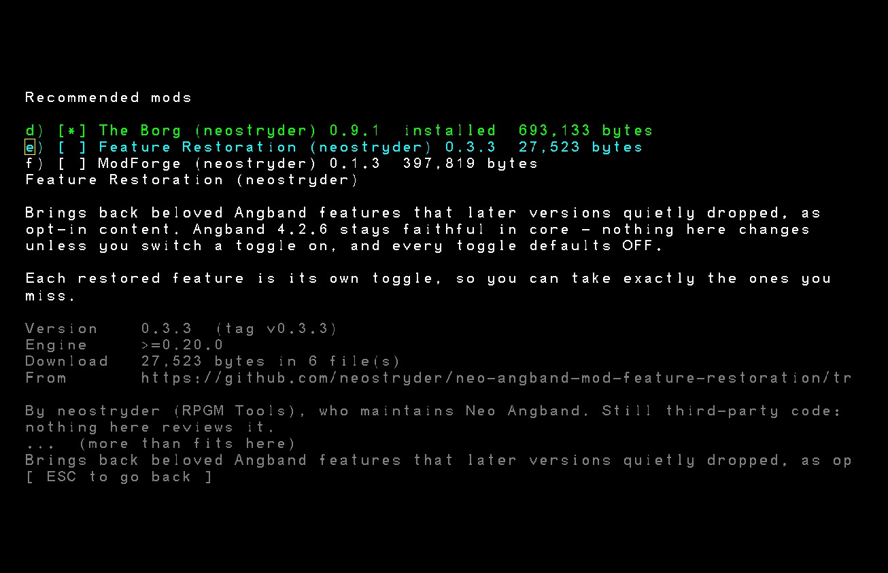

# Cutting Room Floor

Angband features that later versions dropped, and content upstream wrote but never switched on, brought back as opt-in content for [Neo Angband](https://github.com/neostryder/neo-angband). The name comes from the Skyrim mod that does the same for that game's cut content.

**This is a mod.** It is off until you enable it, every restoration inside it is a named switch you can turn off on its own, and disabling the mod leaves the game as Angband 4.2.6 plays it.



## What belongs here

Two kinds of content belong here: features Angband shipped and a later release removed, and content upstream wrote and never switched on, found in the game's repository or its git history, such as an artifact record left commented out. Each section names the release it last shipped in, or the commit that added it unused.

Rebalances, house rules and anything with no upstream source stay out.

The identify-sell-restock town loop stays out too, because 4.2.6 still has it. `birth_no_selling` ("Increase gold drops but disable selling") is a birth option in the base game, on by default, and that default is what makes selling feel removed. Turn it off when you start a character and stores buy again, with no mod installed at all.

## What it adds

Every toggle below defaults **off**. Enabling this mod changes nothing on its own.
You still choose which restorations you actually want.

See the [settings reference](SETTINGS.md) for every flag, its default, and when a change takes effect.

| Section | Default | What it does |
|---|---|---|
| **Classic arcane books** (`classic-arcane-books`) | off | Restores the nine arcane books for Mage, Rogue and Ranger, including the Ranger's INT-based casting. The choice is locked when the character is born. |
| **Classic prayer books** (`classic-prayer-books`) | off | Restores the nine prayer books for Priest and Paladin. The choice is locked when the character is born. |
| **Classic class chassis** (`classic-class-chassis`) | off | Independently restores the five classic casters' experience penalties, skills and hit dice. The choice is locked when the character is born. |
| **Restore Teleport Other** (`teleport-other`) | off | Gives the Priest, the Paladin and the Ranger the same "teleport the monster in front of you away" spell the Mage and the Rogue already have in Angband 4.2.6. Angband 4.1.3, the last official release before the 4.2.0 spellbook rewrite, gave it to every caster; 4.2.6 kept it for two classes and dropped it for the rest. |
| **Restore store discounts** (`discounts`) | off | Stores occasionally sell an item at a random discount, the way Angband 3.0.6, the last official release to carry the mechanic, did. 4.2.6 dropped the mechanic entirely. |
| **Restore door spiking** (`spike-doors`) | off | Adds Iron Spikes as a findable item and a `spike` command that spends one to jam a closed door, making it harder to pick open. Angband 3.4.1, the last official release before the 4.0 command rewrite dropped both, is the source; 4.2.6 has neither. The command claims the original `j` key by default when it is free; see below. |
| **Restore the "of Fury" weapon ego** (`fury`) | off | Angband 3.0.6 through 3.2.0 could make a sword, polearm or hafted weapon "of Fury": up to +10 to hit and to damage, two to five points of strength, one or two extra blows and immunity to fear, paid for by aggravating the monsters around you. |
| **Restore cut rods, wands and staffs** (`classic-devices`) | off | Brings back six magic devices that later versions removed: the rods of Door/Stair Location and Trap Location (last in 4.0.5), the wand of Door Destruction (last in 4.1.3), and the staffs of Trap Location, Door/Stair Location and Object Location (last in 3.0.9). |
| **Restore cut potions** (`classic-potions`) | off | Brings back seven potions that Angband 3.0.9 had and 3.1.0 removed, plus Lose Memories from 4.1.3. |
| **Restore cut weapons, armour and diggers** (`classic-equipment`) | off | Brings back seven items that Angband 3.0.9 had and 3.1.0 removed: the Sabre, the Small Sword, Rusty Chain Mail, Double Chain Mail, the Gnomish Shovel, the Dwarven Shovel and the Dwarven Pick. |
| **Restore the deadly potions** (`classic-dangers`) | off | Brings back three potions that Angband 3.0.9 had and 3.1.0 removed, each one a disaster to drink before you know what it is. |
| **Restore the monsters cut in 4.2.0** (`monsters-4-1`) | off | Angband 4.2.0 replaced 55 monsters in a pass that made the game's cast fit Tolkien's world: the dark elves, Greek myth such as Medusa, Atlas and the Lernaean Hydra, the ninja and the dagashi, the drider, the black pudding and others. |
| **Restore the novices, swordsmen and angels** (`monsters-3x`) | off | Brings back sixteen monsters from Angband 3.x, alongside the monsters that replaced them. |
| **Add the Amulet of Amandil (never released)** (`amandil`) | off | Upstream wrote this artifact in 2011 and left it commented out, and it has stayed that way in every release since, 4.2.6 included. |
| **Restore the bronze dragons** (`bronze-dragons`) | off | Bronze dragons breathed confusion. |
| **Restore sticky curses** (`sticky-curses`) | off | Matching curses keep worn equipment on until they are removed. Also brings back six cursed items, the Curse Weapon and Curse Armour scrolls and the egos they make. |
| **Restore classic uncursing** (`classic-uncurse`) | off | Remove Curse clears eligible worn curses together, and enchanting can break a curse. |
| **Restore junk items** (`junk`) | off | Adds 14 old junk kinds at a low frequency. |
| **Restore seven ring and amulet flavors** (`flavors`) | off | In 2013 upstream gave seven ring and amulet looks to artifacts. |

### Restore Teleport Other

Angband 4.2.6 ships `Teleport Other`, a bolt spell that teleports the first monster it
hits away, farther at higher character level, for the Mage (`[Magical Defences]`,
level 15) and the Rogue (`[Arcane Control]`, level 30). Angband 4.1.3, released 22 July
2018 and the last official release before the 4.2.0 spellbook rewrite, gave it to the
Priest, the Paladin and the Ranger as well. All three lost it at 4.2.0, the release that
cut pure casters from nine spellbooks to five and hybrid casters to two or three.

This section adds it back to those three, appended to a book each already has rather than
replacing anything:

| Class | Book | Level | Mana | Fail | XP |
|---|---|---|---|---|---|
| Priest | `[Healing and Sanctuary]` | 18 | 10 | 30% | 20 |
| Paladin | `[Healing and Sanctuary]` | 24 | 10 | 30% | 50 |
| Ranger | `[Nature Craft]` | 30 | 10 | 30% | 50 |

The spell's effect and description are copied exactly from the Mage's version, so every caster gets the same spell.

#### Where these numbers come from

The 4.1.3 records say which classes had the spell, but their prices cannot be reused as they are. A spell priced by 4.1.3 and dropped into 4.2.6 would charge a Priest 20 mana at 80 percent failure for a spell the Mage casts at 10 mana and 30 percent, which would be a penalty rather than a restoration. So the 4.1.3 records are the starting point and the two surviving copies of the spell are the guide.

In Angband 4.1.3, the last official release to have them, the three classes had these records, where a spell reads `name:level:mana:fail:exp`:

```
Teleport Other:20:20:80:16    (Priest)
Teleport Other:25:25:80:12    (Paladin)
Teleport Other:31:25:70:3     (Ranger)
```

The rows are the same across the whole 4.1.x series (4.1.0 through 4.1.3), so 4.1.3 is cited only because it is the last tagged release to check them against. The same records survive in the game's own repository as `reference/lib/gamedata/old_class.txt`, which upstream keeps next to the current `class.txt` for this kind of comparison, so every number below can be checked without leaving the checkout. The two classes that kept the spell changed like this:

```
Mage   23:12:60:8   ->  15:10:30:12     level -8, mana -2, fail -30, exp +4
Rogue  31:25:70:3   ->  30:10:30:50     level -1, mana -15, fail -40, exp +47
```

Mana is 10 and fail is 30 for all three classes, because both surviving copies arrive at exactly 10 and 30 from different starting points. That fits a wider change: Angband 4.2 repriced spells to cost the same in every class that has them, and the shift shows up across the whole spell list. Among spells shared by two or more classes, agreement on mana went from 4 of 88 in 4.1.3 to 15 of 29 now, agreement on fail from 23 of 88 to 25 of 29, and agreement on both from 1 of 88 to 14 of 29. Level is the one axis 4.2 kept class-specific.
Level follows the model class, eased for the full caster. The Priest is a full caster and follows the Mage; the Paladin and the Ranger are half casters and follow the Rogue. The Rogue's level fell by 1, so the Paladin goes from 25 to 24 and the Ranger from 31 to 30. The Mage's fell by 8, and the Priest takes a much smaller cut, from 20 to 18. How much smaller is a judgment call rather than something taken from the data: the Mage is the earliest caster in the game, and the deepest cut belongs to it. The Paladin's one-level drop is cosmetic, there for consistency with the Rogue rather than for balance.

Exp follows the caster type. The Priest takes the Mage's change, 16 up to 20, which keeps it in the full-caster range next to the Mage's 12. Both half casters go to 50, matching the Rogue's actual value instead of adding the Rogue's change, because adding +47 to the Paladin's 12 would give 59 and nothing suggests 4.2 would price one spell differently for two half casters. In the current file the Rogue earns roughly four times the Mage's exp for the same spell, on both Teleport Other and Teleport Level, so the pattern being matched is a half-caster range near 50 and a full-caster range of about 12 to 20. Which range each class falls in comes from the data; the exact 50 for the Paladin is a judgment call.

The Ranger's result, `30:10:30:50`, is identical to the Rogue's current row. The two classes also had identical 4.1.3 rows, `31:25:70:3`, so it makes sense that they match again. The test suite checks that equality against the published content pack, so if a future core release reprices the Rogue's copy, the tests fail instead of leaving this mod out of date.

The resulting ladder across all five classes is Mage 15, Priest 18, Paladin 24, Rogue 30, Ranger 30. Full casters get the spell early and half casters late, and the three restored classes keep the order they had in 4.1.3.

The formulas behind the price did not change either, which matters because a changed formula would make these comparisons meaningless. Mana accrual per class is the same: the `magic:` line holding each class's first spell level and spell weight is identical in both files for all five classes (Mage 1:300, Priest 1:350, Rogue 5:350, Ranger 3:400, Paladin 1:400), and failure still falls by 3 points per character level above the spell's own level. A price in mana and fail therefore means the same thing in both versions, and only the price itself needed to move.

If a core release reorders a class's books or adds a spell to one of them, the tests below fail rather than letting this mod patch the wrong slot.
**Where this idea came from:** a
[r/angband comment thread](https://www.reddit.com/r/angband/comments/1vsb2sp/angband_but_moddable/) on the game's
alpha announcement, where a player pointed out that "nearly everyone" had lost Teleport
Other in 4.2, a mechanic every earlier version gave every caster.

### Classic spellbook prices

The historical books replace the current class books when their birth-locked section is on. Every caster starts with the first town book. The optional class chassis changes experience penalties, skills and hit dice independently. Nine books take more pack space than the current set.

The historical class file supplies each spell's effects and experience. A same-named current spell supplies mana and failure chance. For other spells, the generator uses the median mana ratio and median failure change among that class's matched spells in the same level band (levels 1-14, 15-29 or 30 and above). If a band has no matches, it uses all matches for that class. It adjusts each historical level by that class's median matched level change, with a minimum of level 1. Run `node tools/generate-classic-books.mjs` to regenerate the class records and this table from the historical class file and the installed content pack.

| Class | Book | Spell | Level | Mana | Fail | XP |
|---|---|---|---:|---:|---:|---:|
| Mage | [Magic for Beginners] | Magic Missile | 1 | 1 | 22% | 4 |
| Mage | [Magic for Beginners] | Detect Monsters | 1 | 1 | 50% | 4 |
| Mage | [Magic for Beginners] | Phase Door | 1 | 2 | 55% | 4 |
| Mage | [Magic for Beginners] | Light Area | 1 | 2 | 26% | 4 |
| Mage | [Magic for Beginners] | Find Traps, Doors & Stairs | 3 | 1 | 20% | 2 |
| Mage | [Magic for Beginners] | Stinking Cloud | 3 | 2 | 27% | 3 |
| Mage | [Conjurings and Tricks] | Confuse Monster | 5 | 4 | 30% | 4 |
| Mage | [Conjurings and Tricks] | Lightning Bolt | 5 | 4 | 30% | 4 |
| Mage | [Conjurings and Tricks] | Disable Traps, Destroy Doors | 5 | 5 | 30% | 6 |
| Mage | [Conjurings and Tricks] | Cure Poison | 5 | 5 | 35% | 4 |
| Mage | [Conjurings and Tricks] | Hold Monster | 7 | 5 | 30% | 4 |
| Mage | [Conjurings and Tricks] | Teleport Self | 7 | 6 | 35% | 5 |
| Mage | [Conjurings and Tricks] | Spear of Light | 7 | 6 | 30% | 5 |
| Mage | [Conjurings and Tricks] | Frost Bolt | 7 | 5 | 40% | 6 |
| Mage | [Conjurings and Tricks] | Wonder | 7 | 10 | 50% | 5 |
| Mage | [Incantations and Illusions] | Remove Hunger | 9 | 1 | 25% | 8 |
| Mage | [Incantations and Illusions] | Lesser Recharging | 9 | 7 | 75% | 10 |
| Mage | [Incantations and Illusions] | Turn Stone to Mud | 9 | 5 | 25% | 8 |
| Mage | [Incantations and Illusions] | Fire Bolt | 10 | 3 | 50% | 7 |
| Mage | [Incantations and Illusions] | Polymorph Other | 11 | 7 | 45% | 9 |
| Mage | [Incantations and Illusions] | Identify Rune | 11 | 7 | 25% | 6 |
| Mage | [Incantations and Illusions] | Reveal Monsters | 15 | 3 | 40% | 6 |
| Mage | [Incantations and Illusions] | Acid Bolt | 15 | 4 | 50% | 8 |
| Mage | [Incantations and Illusions] | Slow Monster | 17 | 9 | 50% | 7 |
| Mage | [Sorcery and Evocations] | Frost Ball | 19 | 6 | 55% | 8 |
| Mage | [Sorcery and Evocations] | Teleport Other | 23 | 10 | 30% | 8 |
| Mage | [Sorcery and Evocations] | Haste Self | 25 | 12 | 65% | 10 |
| Mage | [Sorcery and Evocations] | Mass Sleep | 25 | 7 | 50% | 6 |
| Mage | [Sorcery and Evocations] | Fire Ball | 26 | 5 | 33% | 12 |
| Mage | [Sorcery and Evocations] | Treasure Detection | 30 | 3 | 60% | 10 |
| Mage | [Resistances of Scarabtarices] | Resist Cold | 10 | 5 | 50% | 10 |
| Mage | [Resistances of Scarabtarices] | Resist Fire | 10 | 5 | 50% | 10 |
| Mage | [Resistances of Scarabtarices] | Resist Poison | 25 | 10 | 32% | 20 |
| Mage | [Resistances of Scarabtarices] | Resistance | 28 | 20 | 65% | 30 |
| Mage | [Resistances of Scarabtarices] | Shield | 32 | 24 | 65% | 30 |
| Mage | [Raal's Tome of Destruction] | Shock Wave | 16 | 5 | 40% | 6 |
| Mage | [Raal's Tome of Destruction] | Explosion | 20 | 10 | 50% | 10 |
| Mage | [Raal's Tome of Destruction] | Cloud Kill | 20 | 5 | 50% | 8 |
| Mage | [Raal's Tome of Destruction] | Acid Ball | 20 | 7 | 70% | 20 |
| Mage | [Raal's Tome of Destruction] | Ice Storm | 27 | 11 | 75% | 24 |
| Mage | [Raal's Tome of Destruction] | Meteor Swarm | 30 | 14 | 75% | 34 |
| Mage | [Raal's Tome of Destruction] | Rift | 35 | 20 | 50% | 25 |
| Mage | [Mordenkainen's Escapes] | Door Creation | 13 | 9 | 40% | 12 |
| Mage | [Mordenkainen's Escapes] | Stair Creation | 24 | 20 | 50% | 20 |
| Mage | [Mordenkainen's Escapes] | Teleport Level | 28 | 17 | 65% | 20 |
| Mage | [Mordenkainen's Escapes] | Word of Recall | 30 | 30 | 75% | 15 |
| Mage | [Mordenkainen's Escapes] | Rune of Protection | 36 | 60 | 60% | 40 |
| Mage | [Tenser's Transformations] | Greater Recharging | 30 | 30 | 85% | 100 |
| Mage | [Tenser's Transformations] | Elemental Brand | 32 | 60 | 85% | 120 |
| Mage | [Kelek's Grimoire of Power] | Earthquake | 20 | 18 | 60% | 20 |
| Mage | [Kelek's Grimoire of Power] | Bedlam | 25 | 15 | 60% | 24 |
| Mage | [Kelek's Grimoire of Power] | Rend Soul | 25 | 15 | 80% | 30 |
| Mage | [Kelek's Grimoire of Power] | Banishment | 30 | 45 | 95% | 25 |
| Mage | [Kelek's Grimoire of Power] | Word of Destruction | 33 | 35 | 80% | 35 |
| Mage | [Kelek's Grimoire of Power] | Mass Banishment | 35 | 75 | 90% | 100 |
| Mage | [Kelek's Grimoire of Power] | Chaos Strike | 38 | 15 | 80% | 40 |
| Mage | [Kelek's Grimoire of Power] | Mana Storm | 42 | 16 | 85% | 200 |
| Priest | [Beginners Handbook] | Detect Evil | 1 | 2 | 10% | 4 |
| Priest | [Beginners Handbook] | Cure Light Wounds | 1 | 2 | 15% | 4 |
| Priest | [Beginners Handbook] | Bless | 1 | 2 | 20% | 4 |
| Priest | [Beginners Handbook] | Remove Fear | 1 | 2 | 5% | 4 |
| Priest | [Beginners Handbook] | Call Light | 3 | 3 | 10% | 1 |
| Priest | [Beginners Handbook] | Slow Poison | 3 | 3 | 28% | 4 |
| Priest | [Words of Wisdom] | Scare Monster | 5 | 4 | 29% | 3 |
| Priest | [Words of Wisdom] | Portal | 5 | 4 | 30% | 4 |
| Priest | [Words of Wisdom] | Cure Serious Wounds | 5 | 4 | 32% | 4 |
| Priest | [Words of Wisdom] | Chant | 5 | 5 | 34% | 4 |
| Priest | [Words of Wisdom] | Sanctuary | 7 | 5 | 36% | 3 |
| Priest | [Words of Wisdom] | Remove Hunger | 7 | 1 | 25% | 4 |
| Priest | [Words of Wisdom] | Remove Curse | 7 | 12 | 38% | 5 |
| Priest | [Words of Wisdom] | Resist Heat and Cold | 7 | 7 | 38% | 5 |
| Priest | [Chants and Blessings] | Neutralize Poison | 9 | 6 | 38% | 4 |
| Priest | [Chants and Blessings] | Orb of Draining | 9 | 7 | 40% | 4 |
| Priest | [Chants and Blessings] | Cure Critical Wounds | 9 | 7 | 38% | 4 |
| Priest | [Chants and Blessings] | Sense Invisible | 11 | 4 | 25% | 4 |
| Priest | [Chants and Blessings] | Protection from Evil | 11 | 8 | 42% | 4 |
| Priest | [Chants and Blessings] | Earthquake | 11 | 9 | 55% | 5 |
| Priest | [Chants and Blessings] | Sense Surroundings | 13 | 8 | 35% | 4 |
| Priest | [Chants and Blessings] | Cure Mortal Wounds | 13 | 11 | 45% | 4 |
| Priest | [Chants and Blessings] | Turn Undead | 15 | 12 | 50% | 5 |
| Priest | [Exorcism and Dispelling] | Prayer | 15 | 14 | 50% | 5 |
| Priest | [Exorcism and Dispelling] | Dispel Undead | 17 | 14 | 55% | 7 |
| Priest | [Exorcism and Dispelling] | Heal | 21 | 16 | 60% | 7 |
| Priest | [Exorcism and Dispelling] | Dispel Evil | 25 | 20 | 70% | 12 |
| Priest | [Exorcism and Dispelling] | Glyph of Warding | 33 | 40 | 90% | 15 |
| Priest | [Exorcism and Dispelling] | Holy Word | 39 | 32 | 95% | 20 |
| Priest | [Ethereal Openings] | Blink | 3 | 3 | 50% | 6 |
| Priest | [Ethereal Openings] | Teleport Self | 10 | 6 | 35% | 8 |
| Priest | [Ethereal Openings] | Teleport Other | 20 | 10 | 30% | 16 |
| Priest | [Ethereal Openings] | Teleport Level | 30 | 17 | 65% | 133 |
| Priest | [Ethereal Openings] | Word of Recall | 35 | 30 | 75% | 11 |
| Priest | [Ethereal Openings] | Alter Reality | 40 | 60 | 75% | 250 |
| Priest | [Godly Insights] | Detect Monsters | 3 | 1 | 50% | 2 |
| Priest | [Godly Insights] | Detection | 10 | 10 | 70% | 20 |
| Priest | [Godly Insights] | Perception | 20 | 20 | 80% | 20 |
| Priest | [Godly Insights] | Probing | 25 | 40 | 80% | 150 |
| Priest | [Godly Insights] | Clairvoyance | 35 | 50 | 80% | 230 |
| Priest | [Purifications and Healing] | Cure Serious Wounds | 15 | 5 | 50% | 25 |
| Priest | [Purifications and Healing] | Cure Mortal Wounds | 17 | 7 | 60% | 45 |
| Priest | [Purifications and Healing] | Healing | 30 | 50 | 80% | 130 |
| Priest | [Purifications and Healing] | Restoration | 35 | 70 | 90% | 230 |
| Priest | [Purifications and Healing] | Remembrance | 35 | 30 | 90% | 250 |
| Priest | [Holy Infusions] | Unbarring Ways | 5 | 6 | 50% | 40 |
| Priest | [Holy Infusions] | Recharging | 15 | 10 | 50% | 25 |
| Priest | [Holy Infusions] | Dispel Curse | 25 | 40 | 80% | 160 |
| Priest | [Holy Infusions] | Enchant Weapon | 35 | 50 | 80% | 230 |
| Priest | [Holy Infusions] | Enchant Armour | 37 | 60 | 85% | 250 |
| Priest | [Holy Infusions] | Elemental Brand | 45 | 95 | 85% | 250 |
| Priest | [Wrath of God] | Dispel Undead | 15 | 14 | 55% | 25 |
| Priest | [Wrath of God] | Dispel Evil | 20 | 20 | 70% | 60 |
| Priest | [Wrath of God] | Banish Evil | 25 | 25 | 80% | 250 |
| Priest | [Wrath of God] | Word of Destruction | 35 | 35 | 80% | 115 |
| Priest | [Wrath of God] | Annihilation | 45 | 60 | 75% | 250 |
| Rogue | [Magic for Beginners] | Detect Monsters | 5 | 1 | 50% | 1 |
| Rogue | [Magic for Beginners] | Phase Door | 7 | 2 | 55% | 1 |
| Rogue | [Magic for Beginners] | Light Area | 9 | 3 | 60% | 1 |
| Rogue | [Magic for Beginners] | Object Detection | 10 | 3 | 60% | 1 |
| Rogue | [Magic for Beginners] | Detect Stairs | 8 | 3 | 50% | 1 |
| Rogue | [Magic for Beginners] | Stinking Cloud | 21 | 8 | 40% | 10 |
| Rogue | [Conjurings and Tricks] | Confuse Monster | 15 | 4 | 65% | 1 |
| Rogue | [Conjurings and Tricks] | Disable Traps, Destroy Doors | 14 | 5 | 30% | 2 |
| Rogue | [Conjurings and Tricks] | Cure Poison | 21 | 6 | 80% | 1 |
| Rogue | [Conjurings and Tricks] | Hold Monster | 19 | 5 | 75% | 1 |
| Rogue | [Conjurings and Tricks] | Teleport Self | 22 | 6 | 35% | 1 |
| Rogue | [Conjurings and Tricks] | Spear of Light | 23 | 6 | 30% | 1 |
| Rogue | [Conjurings and Tricks] | Wonder | 20 | 7 | 60% | 20 |
| Rogue | [Incantations and Illusions] | Remove Hunger | 25 | 1 | 25% | 1 |
| Rogue | [Incantations and Illusions] | Lesser Recharging | 27 | 10 | 89% | 1 |
| Rogue | [Incantations and Illusions] | Turn Stone to Mud | 24 | 5 | 25% | 1 |
| Rogue | [Incantations and Illusions] | Identify Rune | 18 | 7 | 25% | 2 |
| Rogue | [Incantations and Illusions] | Reveal Monsters | 20 | 3 | 40% | 4 |
| Rogue | [Incantations and Illusions] | Slow Monster | 28 | 13 | 60% | 2 |
| Rogue | [Sorcery and Evocations] | Teleport Other | 31 | 10 | 30% | 3 |
| Rogue | [Sorcery and Evocations] | Haste Self | 32 | 12 | 65% | 6 |
| Rogue | [Sorcery and Evocations] | Mass Sleep | 24 | 10 | 70% | 10 |
| Rogue | [Resistances of Scarabtarices] | Resist Cold | 16 | 8 | 40% | 40 |
| Rogue | [Resistances of Scarabtarices] | Resist Fire | 19 | 8 | 40% | 40 |
| Rogue | [Resistances of Scarabtarices] | Resist Poison | 30 | 10 | 32% | 60 |
| Rogue | [Resistances of Scarabtarices] | Resistance | 31 | 20 | 65% | 80 |
| Rogue | [Resistances of Scarabtarices] | Shield | 34 | 8 | 35% | 80 |
| Rogue | [Raal's Tome of Destruction] | Shock Wave | 35 | 5 | 40% | 50 |
| Rogue | [Raal's Tome of Destruction] | Cloud Kill | 25 | 13 | 50% | 15 |
| Rogue | [Mordenkainen's Escapes] | Door Creation | 17 | 9 | 40% | 15 |
| Rogue | [Mordenkainen's Escapes] | Stair Creation | 25 | 8 | 30% | 25 |
| Rogue | [Mordenkainen's Escapes] | Teleport Level | 25 | 17 | 65% | 20 |
| Rogue | [Mordenkainen's Escapes] | Word of Recall | 36 | 30 | 75% | 18 |
| Rogue | [Tenser's Transformations] | Heroism | 26 | 5 | 30% | 40 |
| Rogue | [Tenser's Transformations] | Berserker | 28 | 13 | 50% | 60 |
| Rogue | [Tenser's Transformations] | Enchant Armor | 31 | 20 | 55% | 90 |
| Rogue | [Tenser's Transformations] | Enchant Weapon | 33 | 50 | 80% | 90 |
| Rogue | [Tenser's Transformations] | Greater Recharging | 35 | 16 | 55% | 100 |
| Rogue | [Tenser's Transformations] | Elemental Brand | 37 | 24 | 40% | 120 |
| Rogue | [Kelek's Grimoire of Power] | Bedlam | 29 | 13 | 60% | 20 |
| Ranger | [Magic for Beginners] | Magic Missile | 1 | 1 | 22% | 1 |
| Ranger | [Magic for Beginners] | Detect Monsters | 1 | 1 | 50% | 2 |
| Ranger | [Magic for Beginners] | Phase Door | 1 | 2 | 55% | 2 |
| Ranger | [Magic for Beginners] | Light Area | 1 | 1 | 5% | 1 |
| Ranger | [Magic for Beginners] | Cure Light Wounds | 1 | 1 | 10% | 1 |
| Ranger | [Magic for Beginners] | Detect Stairs | 1 | 3 | 50% | 2 |
| Ranger | [Magic for Beginners] | Stinking Cloud | 1 | 2 | 10% | 3 |
| Ranger | [Conjurings and Tricks] | Confuse Monster | 1 | 2 | 10% | 2 |
| Ranger | [Conjurings and Tricks] | Lightning Bolt | 1 | 3 | 10% | 3 |
| Ranger | [Conjurings and Tricks] | Disable Traps, Destroy Doors | 1 | 5 | 30% | 3 |
| Ranger | [Conjurings and Tricks] | Cure Poison | 1 | 3 | 15% | 3 |
| Ranger | [Conjurings and Tricks] | Hold Monster | 1 | 3 | 10% | 3 |
| Ranger | [Conjurings and Tricks] | Teleport Self | 1 | 6 | 35% | 3 |
| Ranger | [Conjurings and Tricks] | Spear of Light | 1 | 6 | 30% | 4 |
| Ranger | [Conjurings and Tricks] | Frost Bolt | 1 | 5 | 40% | 4 |
| Ranger | [Conjurings and Tricks] | Wonder | 1 | 7 | 50% | 10 |
| Ranger | [Incantations and Illusions] | Remove Hunger | 3 | 1 | 25% | 3 |
| Ranger | [Incantations and Illusions] | Lesser Recharging | 15 | 7 | 60% | 4 |
| Ranger | [Incantations and Illusions] | Turn Stone to Mud | 1 | 5 | 25% | 4 |
| Ranger | [Incantations and Illusions] | Fire Bolt | 11 | 8 | 30% | 3 |
| Ranger | [Incantations and Illusions] | Polymorph Other | 7 | 7 | 30% | 3 |
| Ranger | [Incantations and Illusions] | Identify Rune | 9 | 7 | 25% | 3 |
| Ranger | [Incantations and Illusions] | Reveal Monsters | 11 | 3 | 40% | 4 |
| Ranger | [Incantations and Illusions] | Acid Bolt | 6 | 6 | 20% | 6 |
| Ranger | [Incantations and Illusions] | Slow Monster | 11 | 8 | 35% | 3 |
| Ranger | [Sorcery and Evocations] | Frost Ball | 13 | 8 | 35% | 6 |
| Ranger | [Sorcery and Evocations] | Teleport Other | 17 | 10 | 30% | 3 |
| Ranger | [Sorcery and Evocations] | Haste Self | 19 | 12 | 65% | 4 |
| Ranger | [Sorcery and Evocations] | Mass Sleep | 9 | 8 | 30% | 4 |
| Ranger | [Sorcery and Evocations] | Fire Ball | 20 | 5 | 33% | 9 |
| Ranger | [Sorcery and Evocations] | Treasure Detection | 21 | 3 | 60% | 10 |
| Ranger | [Resistances of Scarabtarices] | Resist Cold | 1 | 6 | 20% | 30 |
| Ranger | [Resistances of Scarabtarices] | Resist Fire | 1 | 6 | 20% | 30 |
| Ranger | [Resistances of Scarabtarices] | Resist Poison | 12 | 10 | 32% | 50 |
| Ranger | [Resistances of Scarabtarices] | Resistance | 17 | 20 | 65% | 70 |
| Ranger | [Resistances of Scarabtarices] | Shield | 21 | 14 | 65% | 80 |
| Ranger | [Raal's Tome of Destruction] | Cloud Kill | 8 | 7 | 30% | 6 |
| Ranger | [Raal's Tome of Destruction] | Acid Ball | 16 | 12 | 60% | 6 |
| Ranger | [Raal's Tome of Destruction] | Ice Storm | 21 | 17 | 60% | 10 |
| Ranger | [Raal's Tome of Destruction] | Meteor Swarm | 22 | 22 | 70% | 35 |
| Ranger | [Mordenkainen's Escapes] | Door Creation | 6 | 9 | 40% | 25 |
| Ranger | [Mordenkainen's Escapes] | Stair Creation | 18 | 15 | 40% | 40 |
| Ranger | [Mordenkainen's Escapes] | Teleport Level | 20 | 17 | 65% | 15 |
| Ranger | [Mordenkainen's Escapes] | Word of Recall | 21 | 30 | 75% | 16 |
| Ranger | [Mordenkainen's Escapes] | Rune of Protection | 26 | 36 | 70% | 80 |
| Ranger | [Tenser's Transformations] | Heroism | 4 | 5 | 30% | 40 |
| Ranger | [Tenser's Transformations] | Berserker | 9 | 12 | 50% | 35 |
| Ranger | [Tenser's Transformations] | Enchant Armor | 19 | 22 | 80% | 50 |
| Ranger | [Tenser's Transformations] | Enchant Weapon | 20 | 50 | 80% | 60 |
| Ranger | [Tenser's Transformations] | Greater Recharging | 21 | 24 | 85% | 115 |
| Ranger | [Tenser's Transformations] | Elemental Brand | 17 | 29 | 85% | 180 |
| Ranger | [Kelek's Grimoire of Power] | Earthquake | 16 | 13 | 50% | 16 |
| Ranger | [Kelek's Grimoire of Power] | Bedlam | 18 | 14 | 60% | 12 |
| Ranger | [Kelek's Grimoire of Power] | Word of Destruction | 23 | 35 | 80% | 30 |
| Paladin | [Beginners Handbook] | Detect Evil | 1 | 2 | 10% | 4 |
| Paladin | [Beginners Handbook] | Cure Light Wounds | 1 | 2 | 15% | 4 |
| Paladin | [Beginners Handbook] | Bless | 1 | 2 | 20% | 4 |
| Paladin | [Beginners Handbook] | Remove Fear | 1 | 2 | 0% | 4 |
| Paladin | [Beginners Handbook] | Call Light | 1 | 3 | 10% | 4 |
| Paladin | [Beginners Handbook] | Slow Poison | 5 | 5 | 20% | 3 |
| Paladin | [Words of Wisdom] | Scare Monster | 5 | 5 | 20% | 3 |
| Paladin | [Words of Wisdom] | Portal | 5 | 4 | 30% | 3 |
| Paladin | [Words of Wisdom] | Cure Serious Wounds | 7 | 7 | 20% | 3 |
| Paladin | [Words of Wisdom] | Chant | 7 | 8 | 25% | 3 |
| Paladin | [Words of Wisdom] | Sanctuary | 7 | 8 | 25% | 3 |
| Paladin | [Words of Wisdom] | Remove Hunger | 9 | 1 | 25% | 3 |
| Paladin | [Words of Wisdom] | Remove Curse | 9 | 12 | 38% | 4 |
| Paladin | [Words of Wisdom] | Resist Heat and Cold | 11 | 3 | 20% | 4 |
| Paladin | [Chants and Blessings] | Neutralize Poison | 11 | 4 | 25% | 4 |
| Paladin | [Chants and Blessings] | Orb of Draining | 13 | 7 | 40% | 4 |
| Paladin | [Chants and Blessings] | Cure Critical Wounds | 13 | 4 | 25% | 4 |
| Paladin | [Chants and Blessings] | Sense Invisible | 15 | 4 | 25% | 4 |
| Paladin | [Chants and Blessings] | Protection from Evil | 15 | 8 | 42% | 4 |
| Paladin | [Chants and Blessings] | Earthquake | 17 | 5 | 25% | 3 |
| Paladin | [Chants and Blessings] | Sense Surroundings | 19 | 8 | 35% | 3 |
| Paladin | [Chants and Blessings] | Cure Mortal Wounds | 21 | 5 | 25% | 3 |
| Paladin | [Chants and Blessings] | Turn Undead | 23 | 6 | 25% | 3 |
| Paladin | [Exorcism and Dispelling] | Prayer | 25 | 6 | 25% | 3 |
| Paladin | [Exorcism and Dispelling] | Dispel Undead | 27 | 14 | 55% | 3 |
| Paladin | [Exorcism and Dispelling] | Heal | 29 | 20 | 60% | 3 |
| Paladin | [Exorcism and Dispelling] | Dispel Evil | 31 | 20 | 70% | 4 |
| Paladin | [Ethereal Openings] | Blink | 3 | 5 | 30% | 2 |
| Paladin | [Ethereal Openings] | Teleport Self | 16 | 6 | 35% | 4 |
| Paladin | [Ethereal Openings] | Teleport Other | 21 | 10 | 30% | 12 |
| Paladin | [Ethereal Openings] | Teleport Level | 31 | 17 | 65% | 115 |
| Paladin | [Ethereal Openings] | Word of Recall | 36 | 30 | 75% | 10 |
| Paladin | [Godly Insights] | Detect Monsters | 1 | 1 | 50% | 1 |
| Paladin | [Godly Insights] | Detection | 11 | 10 | 70% | 12 |
| Paladin | [Godly Insights] | Perception | 21 | 7 | 55% | 16 |
| Paladin | [Godly Insights] | Probing | 26 | 11 | 80% | 135 |
| Paladin | [Purifications and Healing] | Cure Serious Wounds | 5 | 3 | 30% | 25 |
| Paladin | [Purifications and Healing] | Cure Mortal Wounds | 16 | 3 | 35% | 35 |
| Paladin | [Purifications and Healing] | Restoration | 41 | 70 | 90% | 250 |
| Paladin | [Holy Infusions] | Unbarring Ways | 6 | 12 | 30% | 20 |
| Paladin | [Holy Infusions] | Recharging | 21 | 10 | 50% | 15 |
| Paladin | [Holy Infusions] | Enchant Weapon | 36 | 50 | 80% | 200 |
| Paladin | [Holy Infusions] | Enchant Armour | 38 | 60 | 85% | 250 |
| Paladin | [Holy Infusions] | Elemental Brand | 43 | 68 | 85% | 250 |
| Paladin | [Wrath of God] | Dispel Undead | 16 | 14 | 55% | 20 |
| Paladin | [Wrath of God] | Banish Evil | 26 | 25 | 80% | 200 |
| Paladin | [Wrath of God] | Word of Destruction | 36 | 35 | 80% | 100 |

### Restore store discounts

Older versions of Angband rolled a random discount whenever a store restocked an item. The roll lived in `mass_produce`, the routine that decides how much of an item a store stocks when it restocks, and ran right after it sized the stack. The code is unchanged from Angband 3.0.0 through Angband 3.0.6 (18 June 2005), the last official release to carry it. Three beta snapshots followed (3.0.7s1, 3.0.7s2 and 3.0.7s3, released by a maintainer-to-be before she was made maintainer) and still had the same code, but none of them was an official release, and Angband never shipped an official 3.0.7. Angband 3.0.8 (8 July 2007), the next official release after 3.0.6, removed the roll as part of what its own changelog calls a "semi-rewrite of the store code," and no official release since has brought it back.

The code was removed in 3.0.8, decades before the tag this port targets, so the `reference/` tree in the game's repository does not have it. It comes from upstream's own history instead (`gh api repos/angband/angband/contents/src/store.c?ref=v3.0.6`), and the roll reads:

```c
/* Pick a discount (store.c, mass_produce, Angband 3.0.6) */
if (cost < 5)            discount = 0;
else if (rand_int(25) == 0)  discount = 10;
else if (rand_int(50) == 0)  discount = 25;
else if (rand_int(150) == 0) discount = 50;
else if (rand_int(300) == 0) discount = 75;
else if (rand_int(500) == 0) discount = 90;
```

Each check runs only if the one before it missed, cheapest tier first, and an item under 5 gold never qualifies. This section restores exactly that: the same tiers and odds, checked in the same order. Across all five checks, an eligible item has a combined 7.045 percent chance of being discounted. Most ordinary items in low-level stores cost more than 5 gold, so the floor only rules out the cheapest ones. For mod authors, `plugin.ts`'s `discountRoll` is a direct transcription, and `plugin.test.ts` asserts the exact `oneIn` calls (25, then 50, then 150, then 300, then 500) in that order, not just the resulting percentages.

4.2.6 dropped both the roll and the field it wrote to (`obj->discount`), so there is nothing left in core to patch data onto. That is why this one restoration needs `plugin.ts` instead of a `class.json`-style content patch; see the section below.
### Restore door spiking

Older Angband let you jam a closed door shut with an iron spike, making it harder to open. That was useful for buying time against something chasing you, or for sealing off a room you had already cleared. The item (`TV_SPIKE`) and the command (`do_cmd_spike`) are unchanged from Angband 3.0.0 through Angband 3.4.1 (18 October 2012), the last official release to carry either. Angband 4.0.0, the next official release, rewrote command handling from switch-driven functions to a table of registered commands and dropped both the item kind and the command along the way. No official release since has brought either back, and neither exists anywhere in 4.2.6. The `DOOR_JAMMED` terrain flag this port still carries as a generated constant is a leftover too, since nothing sets it. Taken from upstream's own history (`gh api repos/angband/angband/contents/src/cmd2.c?ref=v3.4.1` for the command, `.../lib/edit/object.txt?ref=v3.4.1` for the item), the mechanism reads:
```c
/* Jam a closed door with a spike (cmd2.c, do_cmd_spike, Angband 3.4.1) */
/* Convert "locked" to "stuck" */
if (cave->feat[y][x] < FEAT_DOOR_HEAD + 0x08)
    cave->feat[y][x] += 0x08;
/* Add one spike to the door */
if (cave->feat[y][x] < FEAT_DOOR_TAIL)
    cave->feat[y][x] += 0x01;
```

A door's feature byte packed two separate numbers from 0 to 7. An unspiked door had its own lock strength (0-7), checked by the normal lock-picking roll. Once it was spiked at all, it had a *jammed* level instead (also 0-7), and the pick roll was never even attempted: a jammed door could not be picked, only bashed down. The item's own description (`lib/edit/object.txt`) states the cap in plain language: "Each of the first 7 spikes will increase the door's resistance to bashing. Placing more than 7 spikes in one door will not have any further effect."

This port keeps part of that behaviour and leaves out the rest. It never had a separate jammed or stuck door state. A closed door here has one continuous lock-power number (the "door lock" trap, `game/trap.ts`), which feeds the same `skill - 4 * power` formula upstream already used for its locked-door pick chance. Spiking raises that number by one point per spike, up to 7, the same ceiling upstream put on its separate jam level. What does not carry over is upstream's hard wall, where a fully jammed door cannot be picked at all and bashing it down is the only way through. This port has no player command for bashing a door down (upstream's `do_cmd_bash`, which would be a separate restoration that this mod does not attempt), so a pick-proof door here would be a door you could never get back through, rather than just a harder one. A door at this mod's cap keeps upstream's own floor instead: `skill - 28`, minimum 2%, which is hard to pick but never impossible.
One more edge case is simplified. In upstream, spiking a door that has a monster standing in it attacks the monster instead (`py_attack`) and still uses the turn. Reproducing that would mean re-deriving core's melee math inside this mod, so here the attack does not happen: the turn is spent and the spike is not used. `plugin.test.ts` tests this simplified behaviour, not upstream's fuller version.

**The item.** Angband dropped `TV_SPIKE` itself before this port's 4.2.6 baseline, so there is no existing tval to add an Iron Spike under the way upstream had it, and adding a whole new item class would be a bigger change than this restoration needs (see "Content, plus one plugin" below). The Iron Spike in `object.json` borrows the `flask` tval instead. Core's own Flask of Oil is the closest real precedent: a small, stackable, single-purpose consumable with no weapon or armour behaviour to clash with. The Iron Spike carries `NO_FUEL`, so borrowing the tval does not let it refuel a lamp or pick up Flask of Oil's behaviour. Its weight (0.2 lb), cost (1 gold) and where it is found (dungeon levels 1-40, uncommon) are copied from the item's own Angband 3.4.1 record.

**Restored item art.** A restored item uses its own pack's confirmed historical art when that art still exists. If the active pack has none, the item uses the highest-resolution confirmed real substitute from another bundled pack whose resolution is at or below the active pack's own, and never a higher-resolution substitute. Only when no confirmed historical art exists anywhere does the item keep its ASCII glyph. When a pack has its own Linoleum conversion, the item's tile is declared as a standalone asset of that pack; a raw sheet coordinate is used only for a pack with no Linoleum conversion at all. Every restored item in this mod family follows these rules. New content that a mod adds follows the tile pack's normal donor policy instead, and Linoleum documents how to opt out of it.

**Reaching the command in play.** `plugin.ts` installs `feature-restoration:spike` through `registry:command`, names it with `commands.setVerb`, and claims the `j` key by default through the `keymap:write` capability. In Angband 3.4.1's original keyset, `j` was the key for jamming a door. The claim only succeeds when the current keyset leaves `j` free, so it never replaces a binding made by you or by another mod. If `j` is already taken or keymap access was not granted, you can still bind the command yourself in the keymap editor.
### Restore the "of Fury" weapon ego

"Of Fury" was a live weapon ego from Angband 3.0.6 through 3.2.0. In June 2011 upstream commit `d65dfe355` ("Merge Timo's item changes") commented out its three `type:` lines (sword, polearm, hafted) and kept everything else, and the record is still in 4.2.6's `ego_item.txt` in 4.2 syntax. With no weapon type, no weapon can carry it. This section sets the three types back and touches nothing else, so the numbers are 4.2.6's own: commonness 2 from depth 50, +d10 to hit and to damage, strength, one or two extra blows, protection from fear, and aggravation.

In the game's own item-power rating (`object_power`), a level-60 Long Sword averages 139 with Fury, below (Defender) at 149 and above of Extra Attacks at 80. `ego-fury.test.ts` measures this over 400 fixed seeds and fails if Fury ever rates above (Defender).

### Restore cut rods, wands, staffs, potions and equipment

These four sections bring back records that later releases removed and 4.2.6 does not have under any name:

| Section | Records | Last release |
|---|---|---|
| `classic-devices` | rods of Door/Stair Location and Trap Location; wand of Door Destruction; staffs of Trap Location, Door/Stair Location and Object Location | 4.0.5, 4.1.3 and 3.0.9 |
| `classic-potions` | Weakness, Stupidity, Naivety, Clumsiness, Sickliness, Apple Juice, Water, Lose Memories | 3.0.9 and 4.1.3 |
| `classic-equipment` | Sabre, Small Sword, Rusty Chain Mail, Double Chain Mail, Gnomish Shovel, Dwarven Shovel, Dwarven Pick | 3.0.9 |
| `classic-dangers` | Death, Ruination, Detonations | 3.0.9 |

Many items that look cut were only renamed, and those are left out because the game already has them. The Sleep Monster wand and rod are Hold Monster, the Disarming wand and rod are Disable Traps, the Shadow Cloak is the Elven Cloak, the Shield of Deflection is the Mithril Shield, and the Orcish Pick is the Pick. Each keeps its old level, weight and cost, and `restored-records.test.ts` fails if a restored record matches a 4.2.6 record on type, level, weight, cost, dice, armour and effects.

Where a record needed a change to fit 4.2, the reason is written beside it in `tools/restore/`:

- **Armour and digging.** 4.2 raised body armour values and replaced numeric digging with three grades. Rusty and Double Chain Mail take the armour class their 3.0.9 equals have in 4.2 (Chain Mail at 32, Augmented Chain Mail at 42), and Rusty Chain Mail's -8 penalty scales the same way to -18. The Gnomish Shovel digs at grade 2 and the Dwarven Shovel and Dwarven Pick at grade 3, the grade 4.2's Mattock has for the same 3.0.9 digging value.
- **Effects.** 3.0.9 wrote effects in code keyed to each item, so each restored 3.0.9 record uses the 4.2 effect that does the same thing. The stat potions use `DRAIN_STAT`, the staffs detect over 4.2's standard 22 by 40 area, and the deadly potions use `DAMAGE`, `DRAIN_STAT` and `TIMED_INC` with 3.0.9's own damage, stun and cut values. Ruination drained Charisma too, which 4.2 does not have.
- **How often.** 3.0.9 gave a depth and a rarity; the conversion keeps the depth and scales rarity against 4.2's usual commonness of 20. The five stat-draining potions are set to 10, 4.2's commonness for Salt Water. Apple Juice and Water were never generated at random in 3.0.9, so they take Slime Mold Juice's allocation and a share of its nourishment in proportion to their 3.0.9 values.

`tools/convert-records.mjs` rebuilds these records from a local clone of upstream Angband's git history and compiles each one with 4.2.6's own gamedata rules.

### Restore the monsters cut in 4.2.0, and the 3.x novices and angels

Of the 55 monsters Angband 4.2.0 cut, 51 handed their tile to a Tolkien-world replacement, and 25 of those replacements kept the old monster's depth, speed and hit points exactly: the jackal became the wild dog, the dark elven priest the ironfist priest, the Cat Lord Tevildo. `monsters-4-1` adds the old records back beside the new ones. For each of those 25 exact pairs, both monsters appear half as often while the section is on, so a depth that drew one wild dog now draws a wild dog or a jackal. The other monsters are simply added. The 4.1.3 casters dropped named spellbooks that 4.2 does not have; they now drop a magic book or a prayer book of no fixed title, the way 4.2's own casters do, so they drop 4.2's books normally and the classic books when those are on.

`monsters-3x` does the same for sixteen 3.x monsters: the six novices (the lone versions, since 3.2.0 also shipped grouped novices under the same names), the Swordsman and Hardened warrior from 3.4.1, and the angels from 3.3.2 on 4.2's Ainu base.

Two monsters stay out. 4.2's Azog, Enemy of the Dwarves is the same character as 4.1.3's Azog, King of the Uruk-Hai, and a game with two Azogs makes no sense. 4.2's craban is 3.4.1's Crebain with its singular name.

### Add the Amulet of Amandil

This one was never in a release. Upstream commit `2744ef5a1` ("Merge jens's artifact changes", 19 June 2011) added it already commented out, and 4.2.6's `artifact.txt` still has it that way. The record's only problem was its base line, `amulet:55`, a numeric reference from before 2016. Index 55 is the Golden amulet flavor, which 4.2 fixed to the artifact base called Necklace, so the restored record uses that base and draws as the golden amulet it was written as. Its level, weight, cost, allocation, flags, values and description are the commented record's own, and `artifact-amandil.test.ts` compares them line by line.

An artifact a mod adds is not redesigned in a random-artifact game, so Amandil keeps these numbers even with `birth_randarts` on.

### Restore the bronze dragons

Upstream commit `0ce785897` ("Remove "bronze" monsters and DSM. Remove BR_CONF from other monsters.", December 2010) set every bronze dragon's rarity to 0, so 3.3.0 through 3.5.1 carried the records without ever generating them. 4.0.0 then deleted them and removed confusion as an element (`bc0a46a01`). Angband 3.2.0 is the last release that put them in play, and it is the source here.

In 3.2.0 the baby bronze dragon and the giant bronze dragon fly were exact copies of their gold siblings, and each larger bronze dragon was a weaker gold dragon. 4.2 rebalanced the gold dragons, so each bronze dragon starts from its 4.2 gold sibling and scales hit points, armour, experience and blow dice by the 3.2.0 bronze-to-gold ratio, with depth moved by the 3.2.0 difference. The mature bronze dragon, for example, had 80% of the mature gold dragon's hit points in 3.2.0, so it has 592 against 4.2's 740. The Great Wyrm of Perplexity had exactly the Great Storm Wyrm's numbers in 3.2.0 and takes 4.2's great storm wyrm with confusion in place of lightning. Bronze Dragon Scale Mail matched Gold on level, cost and breath damage, and takes 4.2's Gold Dragon Scale Mail with 3.2.0 Bronze's weight, armour and depth.

Confusion breath follows 3.2.0's rules, with one change. A monster is confused for (10 + 1d15 + r) / (r + 1) turns, takes half damage if it cannot be confused, and a confusion breather takes dam x 2 / (1d6 + 6). The player is confused for 1d20 + 10 turns. In 3.2.0, resisting confusion also cut the damage. 4.2 made that resistance the protection from confusion, and a 4.2 protection stops a status without reducing damage, so protection here stops the confusion and the damage lands in full. The breath's divisor (hit points / 6) and damage cap (400) are 3.x's own.

### Restore sticky curses

Angband 4.0 made cursed equipment stay on until its curse was removed. This switch restores that rule for the curses that match 4.0's cursed items, and for air swing, the curse (Shattered) weapons carry. Other curses come off as usual, so remove the curse before trying to replace a sticky item. Air swing was not one of 4.0's curses, so a 4.2 weapon that rolls it sticks too.

The switch also brings back the Rings of Woe, Weakness, Stupidity and Aggravate Monster, the Amulet of DOOM, the Staff of Slowness, and the Curse Weapon and Curse Armour scrolls. All of them come from Angband 3.0.9, not 4.0, which had none of them. Curse Weapon turns the wielded weapon into a (Shattered) one and Curse Armour turns worn body armour into (Blasted) armour. The item loses its old ego or artifact powers, takes the new ego's ruined combat values and gains its curse, though an artifact resists half the time. A scroll read with nothing in the slot is used up and does nothing. Those two egos never turn up on their own: reading one of the scrolls is the only way to meet them.

In 3.0.9 a cursed item did its harm through its own negative bonuses, and the curse only kept it on. 4.2 puts the harm in the curse, so each restored item carries the 4.2 curse closest to its old penalty. Every one of those curses has power 40, the light band that 3.0.9's light curse maps to, so Remove Curse lifts it. 4.2 data can hold a negative bonus, but its version of 3.0.9's depth bonus shrinks the penalty with depth where 3.0.9's grew it, so the restored items carry no negative bonuses of their own. The curses are fixed on the item, so they apply even where a curse's own list of item types, such as gloves only for weakness, would not allow them. Allocations follow the rarity rule under Restore cut rods, wands, staffs, potions and equipment: a 3.0.9 rarity of 1 becomes commonness 20.

| Item | 3.0.9 | Here | Why |
|---|---|---|---|
| Ring of Weakness | Strength -(1 + M5), light curse, level 5, rarity 1 | Weakness curse (Strength -10) at 40, level 5, commonness 20 | 4.2's only curse that lowers Strength alone. It is harsher than the old ring. |
| Ring of Stupidity | Intelligence -(1 + M5), light curse, level 5, rarity 1 | Dullness curse (Intelligence and Wisdom -5) at 40, level 5, commonness 20 | 4.2 has no curse that lowers Intelligence alone. |
| Ring of Woe | Random teleports, Wisdom and Charisma -(1 + M5), armour -(5 + M10), light curse, level 50, rarity 1 | Teleportation and dullness curses at 40, level 50, commonness 20 | 4.2 has no Charisma, and dullness adds an Intelligence loss. No 4.2 ring curse lowers armour, so that penalty is gone. |
| Ring of Aggravate Monster | Aggravates, light curse, level 5, rarity 1 | Irritation curse (aggravates, to-hit and to-dam -15) at 40, level 5, commonness 20 | 4.2's only other aggravating curse, vulnerability, costs 50 armour. |
| Amulet of DOOM | All six stats and armour -(d5 + M5), light curse, level 50, rarity 1 | Sickliness and dullness curses at 40, level 50, commonness 20 | Together they lower the five stats 4.2 keeps. The armour penalty is gone. |
| Staff of Slowness | Slows for 15 + d25 turns, 8 + d8 charges, level 40, rarity 1 | The same, commonness 20 | No difference. |
| Curse Weapon and Curse Armour | Level 50, rarity 1 | Commonness 20 from level 50 | The rarity rule. 4.2.6 keeps both records with a commented-out commonness of 10. |
| (Shattered) | To-hit and to-dam -d5, cursed | Air swing curse (to-hit -20) at 40, made sticky | 3.0.9 marked the weapon cursed and did no other harm. Air swing is the 4.2 weapon curse that costs to-hit and nothing else. |
| (Blasted) | Armour -d10, cursed | Vulnerability curse (armour -50, aggravates) at 40 | 3.0.9 marked the armour cursed and did no other harm. Vulnerability is the sticky 4.2 curse for body armour that costs armour. It also aggravates, which the old ego did not. |

### Restore classic uncursing

Angband 4.0's Remove Curse worked item by item. The ordinary form lifted every curse from each worn item whose curses were all light, and left an item alone if any of its curses was heavy or permanent. *Remove Curse* also cleared items with heavy curses. Neither touched an item with a permanent curse, and neither could fail or damage an item. This switch restores those rules and the chance for enchanting to break a curse.

The source decides which form it casts, not a roll. A source that rolls a d50 or larger is the strong form: *Remove Curse* (50 + d50) and the restored Dispel Curse prayer. The scroll of Remove Curse (20 + d20) and the Staff of Remove Curse (35 + d30) are the ordinary form. 4.2's own Remove Curse spell rolls the caster's level plus a die with as many sides as that level, so it becomes the strong form at level 50.

A curse's power sets its band, for 4.2's own curses as well as this mod's: 40 or less is light, 41 to 99 heavy and 100 permanent. 4.2 gives a curse it generates a power of 1d9 plus up to 90 more that grows with depth, so many generated curses are heavy.

An enchant scroll rolls to break a curse after each point it tries to add, as 4.0.5 did: one chance in four each time, half that on an artifact, and never on an item with a permanent curse. A broken curse takes every curse off the item, heavy ones included. The switch does not change how curses are generated.

### Restore junk items

Angband 3.4.1 still had empty bottles, shards of pottery, broken sticks, skulls and bones, and five kinds of skeleton. Angband 3.0.9 also had the Gnome Skeleton, the Filthy Rag and the Broken Dagger and Sword, and it is the source for those four. This switch brings back all 14 kinds with the level, weight, cost, dice and armour of their source release.

Neither release generated eleven of them at random: the bottle, shard, stick, skull, bone and all six skeletons had no allocation, so their allocation here is new. In 3.0.9 the rag had rarity 1 from level 0 and the two broken weapons had rarity 2 from level 0 and again from level 5, which the rarity rule would turn into commonness 20 and 10. All 14 have commonness 1 instead, so that junk stays rare and does not crowd out better finds.

A new character starts with the bottles, shards, sticks, skulls, bones and skeletons ignored, as 3.x hid them. Their three classes appear as Junk, Skeletons and Bottles at the end of the item ignoring setup, so you can bring back any kind you want to collect. The Filthy Rag and the broken dagger and sword are not ignored, because they belong to the game's own armour and sword classes, and the ignore menus never offer a whole kind of those.

### Restore seven ring and amulet flavors

Upstream commit `e08ed1dcb` ("Add some fixed artifact flavors", 4 October 2013) commented out seven random flavors so their index slots could become fixed flavors for artifacts: Ruby (28) became Narya, Sapphire (29) Vilya, Mithril (40) Nenya, Bronze (52) Carlammas and Golden (55) the Necklace of the Dwarves, while the Amber (44) and Coral (46) slots went to the Elfstone (drawn green) and the Evenstar (drawn white). The section appends the seven to core's ring and amulet flavor lists with the colours they had before that commit. They take new indices, 303 to 309, so the artifacts keep theirs. Five of the seven share a name with an artifact's fixed flavor, which brings back the pre-2013 guessing game: an unknown Ruby ring might be Narya.

### Where the tiles come from

`tools/extract-art.py` takes each restored item and monster's tile from upstream's own tile sheets. For every bundled pack it walks back from the record's last release to the newest one whose pref file still maps it, crops that cell from the sheet at the same release, and records in `tools/art-report.json` whether 4.2.6's sheet still holds the same pixels there and what 4.2.6 draws in that cell now. A pack with no tile of its own takes the best real tile from a pack at the same or a lower resolution. No tile from a larger pack is scaled down. The seven restored flavors alias their historical tiles and carry hue rotations where they share art with a fixed artifact flavor. Restored monster art carries hue rotations where its old tile is now used by a 4.2 monster. Hue rotations need Linoleum. Without it, each tinted monster or flavor draws exactly like the 4.2 tile it shares.

## Content, plus one plugin

Restoring a spell to a class's book only takes data. The spell already exists (the Mage and the Rogue cast it today), so nothing new has to run; the class's book just needs one more entry. A [field-level patch](https://github.com/neostryder/neo-angband/blob/master/packages/mod-sdk/src/patch.ts) onto core's own `class.json` does exactly that, and a manifest [section](https://github.com/neostryder/neo-angband/blob/master/docs/modding/MOD_LIFECYCLE.md) turns it on and off. That is all `teleport-other` needs.

Store discounts are different. 4.2.6's core has no discount field and no discount roll left to patch, so there is no data to attach to. Restoring them needed one small addition to the game's own engine: a `registry:store` discount-roll hook alongside the stack-size hook that was already there. This mod's `plugin.ts` installs a handler into it, gated on the `feature-restoration.discounts` rule flag and nothing else. No other system in the game is touched, and with the toggle off the hook is never called at all, like every other disabled mod hook.

Door spiking needs both halves. Iron Spikes are a new `object.json` record (in the `spike-doors` section, borrowing the `flask` tval; see above), and the command that uses them is new behaviour with nothing in core to attach to, so it goes through `registry:command` the same way discounts go through `registry:store`. Both halves are gated on one flag, `feature-restoration.spike-doors`, which is the section's own `flag` field, so you see one toggle rather than a content switch and a behaviour switch that could get out of step. `register()` only calls `commands.register` while that flag is on, so with the section disabled the game has neither the item nor a command referring to it.

The bronze dragons need behaviour of a third kind: confusion as an element. `projection.json` adds the CONFUSION projection as data, and `plugin.ts` installs what it does to the player and to monsters through `registry:projection`, from `src/confusion.ts`. Both are gated on `feature-restoration.bronze-dragons`, the section's own flag, so the handlers never run for a projection that does not exist.

## Needs a core release

Some sections rely on game fixes that are not in a published release yet. The tests run against a loader that already has each fix, and a section listed here must not ship until the game release carrying its fix is out and `manifest.json`'s `engine` floor names it.

| Section | Needs |
|---|---|
| `bronze-dragons` | neostryder/neo-angband#319: the web loader has to declare a mod's monster spells before binding, or the first bronze dragon stops the game from starting. |

The dev pins and manifest require Neo Angband 1.20.0 or later for the new-character hook, restored art fields, and exported experience helpers.

## Installing

The mod is `manifest.json`, its gamedata files (`artifact.json`, `class.json`, `ego_item.json`, `flavor.json`, `message_type.json`, `monster.json`, `monster_spell.json`, `object.json`, `projection.json`) and `plugin.js` (built from `plugin.ts`; see below). You can install it in either of these ways:
- **In the game:** Mods -> **Install a mod...**, which fetches this repository at a
  release tag, never a branch. The install records a SHA-256 of every byte that
  arrived, so the manager can answer later whether the copy on your machine has
  changed; it cannot tell you whether what arrived is what was published here.
- **A folder:** clone this repository into your mods directory, or point the browser
  build at it with **Load mod folder**.

## Working on it

```bash
pnpm install --frozen-lockfile
pnpm verify
```

This typechecks, runs the tests, and (through `pnpm check`, which is part of `verify`) confirms that the committed `plugin.js` matches what `plugin.ts` builds today, so a source edit that was not rebuilt fails instead of shipping stale behaviour. The content tests check every ref and every book index this mod's patches name against `@rpgm-tools/neo-angband-content`, the same published content pack a player's game boots from. If a future core release renumbers a class's books, adds a spell ahead of where this mod appends, or ships Teleport Other to a class this mod also restores it to, the test failure says what moved instead of the patch quietly landing on the wrong slot.
```bash
pnpm build   # plugin.ts -> plugin.js, after editing plugin.ts
```

### Adding another restored feature

For each new restoration:

1. Confirm the feature existed in a released Angband and is really gone from 4.2.6. When the feature is content, `reference/lib/gamedata/` in the game's repository is the primary source; when it is not, use a real upstream tag's source, fetched with `gh api` as for the discount roll above. Memory of "the way it used to be" is not evidence.
2. Decide between content and plugin the same way the three features above did. If 4.2.6 still has the field or record to patch, use a manifest `section` with `fieldPatches`, nested the same way `teleport-other` is in `class.json`. If the item or record itself is gone (like `spike-doors`'s Iron Spike), use a `section` with `records` instead: a new entry under an existing tval. A new item class would be a bigger change, and this mod has not needed one yet. If 4.2.6 dropped the underlying mechanism entirely, the restoration needs a `registry:*` capability, either one that already exists (`registry:command`, used by `spike-doors`) or a real addition to the game's own engine first (`registry:store`, added for `discounts`), plus a `rules[]` or section `flag` toggle here.
3. Give it its own row in this README's table and its own toggle, defaulting to off. A restoration that needs both a record and behaviour uses one section for both, so the player sees one toggle rather than two that could get out of step (`spike-doors` does this: the item's `records` and the command's `registry:command` gate share one `flag`).
4. Add tests shaped like `teleport-other.test.ts` for a content section (assert the ref resolves, that core does not already have the feature, that the target is named by name and not by index, and that nothing collides) or like `plugin.test.ts` for a plugin (assert the flag gates it, and assert the mechanism's exact odds and behaviour against a fake host and a recording Rng, not just its outputs), or both, the way `object-spike.test.ts` and `plugin.test.ts` split `spike-doors` between them.
## Releasing

Pushing a tag matching `vX.Y.Z` makes the release; there is no separate publish step. The releases site at releases.rpgm.tools picks up each new release and posts it to the Neo Angband announcements forum on Discord.

## Questions, or something wrong

[**The RPGM Tools Discord**](https://discord.gg/YegtwbHTBQ) is the fastest way
to ask anything, whether a level or a fail rate is intended, how to get this installed,
or what you should try next. No GitHub account needed.

[Open an issue here](https://github.com/neostryder/neo-angband-mod-feature-restoration/issues/new/choose) for a bug in this mod. Two kinds of problem belong against the game instead, and the forms will point you there: the mod system (an install that fails, a load order that will not stick, a conflict report that looks wrong), and the game not matching Angband 4.2.6 while this mod is switched off. With the mod on, differences from 4.2.6 are expected, since changing the game is what the mod does.

For anything that should not be public, including a security report:
**strider-angband (at) rpgm.tools**. See
[SECURITY.md](https://github.com/neostryder/neo-angband/blob/master/SECURITY.md).

Asking about AI use in this project? [AI_USAGE_POLICY.md](AI_USAGE_POLICY.md) is
the complete answer.

[TERMS.md](TERMS.md) covers use of this mod. The core repository's
[PRIVACY.md](https://github.com/neostryder/neo-angband/blob/master/PRIVACY.md)
covers what is stored and what network requests the game makes. Project
participation is subject to the shared [CODE_OF_CONDUCT.md](CODE_OF_CONDUCT.md).

## Licence

Same dual licence as Neo Angband and Angband: GPL v2 or the Angband licence. See
[LICENSE.md](LICENSE.md).

## Credits

Built by neostryder / RPGM Tools as part of Neo Angband. Angband is the work of Ben
Harrison, James E. Wilson, Robert A. Koeneke and the Angband contributors.
